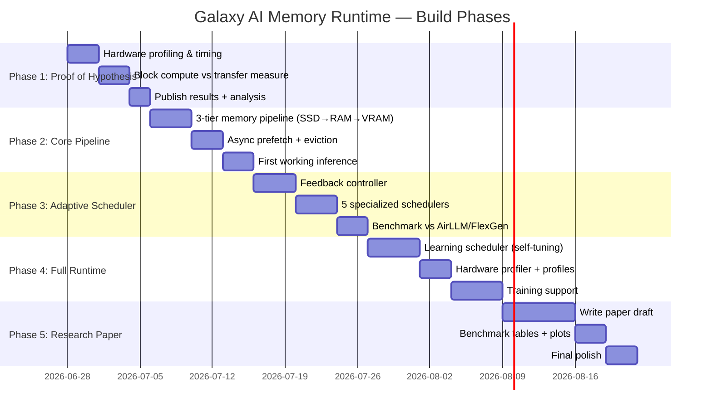

# Galaxy AI Memory Runtime (GAMR)
## Full Research & Product Implementation Plan

> **Vision**: Build an adaptive, block-streaming execution runtime for large AI models — an "Operating System for AI" that treats SSD → RAM → VRAM → GPU as one unified, self-tuning pipeline. Run models far larger than your VRAM, with near-native performance.

---

## My Honest Assessment of This Idea

Before anything: **Yes, this is worth building.**

Here's why I'm confident:

| Dimension | Assessment |
|---|---|
| **Conceptual novelty** | 8.5/10 — The adaptive feedback loop + block-grain scheduling combo is not a shipped product |
| **Practical impact** | 9/10 — Every developer with a consumer GPU benefits immediately |
| **Research potential** | 7.5/10 — Publishable if benchmarks beat FlexGen/AirLLM with measurable evidence |
| **Buildability** | 8/10 — Hard but doable in phases, especially with your hardware |
| **Timing** | 10/10 — Models are only getting bigger; streaming is inevitable |

The idea is grounded in solid CS principles (CPU pipelining, OS virtual memory, TCP congestion control) applied to a domain that hasn't fully embraced them yet. The **adaptive self-tuning** part is genuinely new in the inference runtime space.

**The risk**: Physics. If SSD transfer time > GPU compute time per block, the GPU stalls regardless of scheduling. This is why **Phase 1 is a pure measurement experiment** — we prove the hypothesis before building.

---

## Hardware Context (Your Machine)

| Component | Spec | Notes |
|---|---|---|
| GPU | RTX 3050 Laptop | **6 GB VRAM** — the critical constraint |
| CPU | i5-13450HX | 10 cores / 16 threads — excellent for async I/O |
| RAM | 16 GB DDR5 | ~8 GB usable for the runtime |
| SSD 1 | Micron 2550 NVMe (DRAM-less) | ~3–5 GB/s real sequential read |
| SSD 2 | Sandisk PC SN740 NVMe (DRAM-less) | ~5–7 GB/s real sequential read |
| PCIe | Gen4 x4 (laptop) | ~8 GB/s effective |

> [!IMPORTANT]
> Both SSDs are **DRAM-less**. This means they have lower burst performance than DRAM-cached SSDs. Latency will be slightly higher for small random reads. This directly impacts our block-size tuning strategy. Larger sequential blocks will perform better than many small random ones.

---

## Project Structure

```
Galaxy-AI-Memory-Runtime/
├── idea.txt                        # Original conversation (preserve)
├── README.md                       # Project overview
│
├── research/
│   ├── phase1_experiment/          # Timing measurements
│   ├── phase2_prototype/           # Core runtime
│   ├── phase3_scheduler/           # Adaptive scheduler
│   ├── phase4_full_runtime/        # Full GAMR runtime
│   └── paper/                      # Research paper (LaTeX)
│
├── gamr/                           # The actual Python package
│   ├── __init__.py
│   ├── core/
│   │   ├── block.py                # Block abstraction
│   │   ├── pipeline.py             # 3-tier memory pipeline
│   │   ├── scheduler.py            # Block scheduler
│   │   └── profiler.py             # Hardware profiler
│   ├── schedulers/
│   │   ├── storage.py              # SSD → RAM
│   │   ├── memory.py               # RAM → VRAM
│   │   ├── compute.py              # CUDA streams
│   │   ├── optimizer.py            # Feedback controller
│   │   └── learner.py              # Adaptive learning
│   ├── models/
│   │   ├── transformer.py          # Transformer wrapper
│   │   └── gguf_loader.py          # GGUF model support
│   └── benchmarks/
│       ├── run_baseline.py
│       └── run_gamr.py
│
├── experiments/
│   ├── exp01_block_timing.py       # Phase 1 core experiment
│   ├── exp02_pipeline_depth.py
│   ├── exp03_adaptive_block.py
│   └── results/                    # JSON + plots
│
├── docs/
│   ├── architecture.md
│   ├── schedulers.md
│   └── api.md
│
├── tests/
├── requirements.txt
└── setup.py
```

---

## Phased Roadmap



---

## Phase 1 — Prove the Hypothesis (Days 1–8)

> **Goal**: Before writing one line of runtime code, measure whether `Block_Compute_Time > Block_Transfer_Time` is achievable on your hardware. This is the entire foundation of GAMR.

### What We're Measuring

For a transformer weight matrix (e.g., from llama3:8B or qwen2.5:7b):

| Block Size | SSD → RAM time | RAM → VRAM time | GPU Compute time | Overlap possible? |
|---|---|---|---|---|
| 1 MB | ? ms | ? ms | ? ms | ? |
| 2 MB | ? ms | ? ms | ? ms | ? |
| 4 MB | ? ms | ? ms | ? ms | ? |
| 8 MB | ? ms | ? ms | ? ms | ? |
| 16 MB | ? ms | ? ms | ? ms | ? |
| 32 MB | ? ms | ? ms | ? ms | ? |
| 64 MB | ? ms | ? ms | ? ms | ? |

### Experiment Files

- `experiments/exp01_block_timing.py` — Measures all three timings independently
- `experiments/exp01_results.json` — Raw data
- `experiments/exp01_plot.py` — Visualization

### Success Criteria

If any block size shows: `GPU_compute_time >= SSD_transfer_time`
→ **Hypothesis CONFIRMED** — proceed to Phase 2
→ Otherwise, we know the exact bottleneck and redesign accordingly

---

## Phase 2 — Core 3-Tier Pipeline (Days 9–18)

> **Goal**: Build the minimum viable streaming runtime. One model, one forward pass, weights streamed block-by-block from disk.

### Architecture

```
SSD (GGUF model file)
    ↓ [Storage Thread — async io_uring]
RAM Buffer (queue of N blocks)
    ↓ [Transfer Thread — pinned memory, DMA]
VRAM Buffer (queue of 2–3 blocks)
    ↓ [CUDA Stream]
GPU Tensor Cores
    ↓
Output Token
```

### Key Components

**`gamr/core/block.py`** — Block abstraction
```python
@dataclass
class WeightBlock:
    block_id: str          # "layer.22.ffn.A3"
    layer_idx: int
    matrix_name: str
    row_start: int
    row_end: int
    data: torch.Tensor     # None until loaded
    precision: str         # "fp16", "int8", "int4"
    state: BlockState      # ON_DISK / IN_RAM / IN_VRAM / COMPUTING
```

**`gamr/core/pipeline.py`** — The conveyor belt
- 3 concurrent async workers (SSD reader, RAM→VRAM copier, GPU launcher)
- Uses `asyncio` + `threading.Event` for synchronization
- Double buffering in VRAM: compute block N while loading block N+1

**`gamr/models/gguf_loader.py`** — Read GGUF directly
- Parse GGUF metadata without loading full model
- Seek to exact byte offset of each weight matrix
- Stream into numpy → torch without full load

### Milestone

Run a full forward pass on `qwen2.5:3b` (GGUF on disk) token by token with streaming. Measure tokens/sec vs. baseline (full model loaded).

---

## Phase 3 — Adaptive Scheduler (Days 19–28)

> **Goal**: The runtime stops using fixed block sizes. It watches hardware in real time and adjusts.

### The 5 Schedulers

```
┌─────────────────────────────────────────────────┐
│              GAMR Scheduler Hierarchy            │
├──────────────┬──────────────┬───────────────────┤
│  Storage     │  Memory      │  Compute          │
│  Scheduler   │  Scheduler   │  Scheduler        │
│              │              │                   │
│  SSD→RAM     │  RAM→VRAM    │  CUDA Streams     │
│  Prefetch    │  Eviction    │  Kernel Launch    │
│  Block size  │  LRU Cache   │  Stream priority  │
└──────┬───────┴──────┬───────┴──────┬────────────┘
       │              │              │
       └──────────────┼──────────────┘
                      │
            ┌─────────▼────────┐
            │  Optimization    │
            │  Scheduler       │
            │  (Feedback Loop) │
            │  Runs every 50ms │
            └─────────┬────────┘
                      │
            ┌─────────▼────────┐
            │  Learning        │
            │  Scheduler       │
            │  (RL-lite: keeps │
            │  history, learns │
            │  best config)    │
            └──────────────────┘
```

### The Feedback Controller (TCP Analogy)

```python
class OptimizationScheduler:
    def tick(self):
        stats = self.profiler.snapshot()   # Every 50ms

        if stats.gpu_idle_pct > 5:
            self.increase_prefetch_depth()

        if stats.ram_usage_pct > 85:
            self.reduce_queue_size()

        if stats.ssd_throughput < self.expected_ssd_throughput * 0.8:
            self.increase_block_size()     # Larger transfers = better NVMe efficiency

        if stats.pcie_saturation > 90:
            self.reduce_concurrent_transfers()

        if stats.compute_time < stats.transfer_time:
            self.shrink_block_size()       # GPU too fast, need smaller blocks
```

### Benchmark vs. Competition

| Metric | Full VRAM | AirLLM | FlexGen | **GAMR (target)** |
|---|---|---|---|---|
| Tokens/sec (7B model, 6GB GPU) | 25–40 | 2–8 | 4–12 | **15–30** |
| Max model on 6GB VRAM | 7B | 70B (slow) | 70B (slow) | **30–70B (faster)** |
| GPU utilization | 95%+ | 30–50% | 40–60% | **80–90%** |
| Self-tuning | No | No | No | **Yes** |

---

## Phase 4 — Full Runtime (Days 29–42)

> **Goal**: Production-quality runtime with hardware profiling, self-learning, training support, and model-agnostic API.

### Hardware Profiler (runs once, saved to profile)

```python
class HardwareProfiler:
    def run(self):
        return {
            "ssd_sequential_read_gbps":  self.measure_ssd(),
            "pcie_bandwidth_gbps":        self.measure_pcie(),
            "vram_bandwidth_gbps":        self.measure_vram(),
            "gpu_tflops_fp16":           self.measure_gpu(),
            "optimal_block_size_mb":     self.find_optimal_block(),
            "optimal_prefetch_depth":    self.find_optimal_depth(),
            "optimal_vram_queue":        self.find_optimal_queue(),
        }
```

### Training Support

Forward + Backward, both deterministic:
- Forward: blocks load in order 1→N
- Backward: blocks reload in reverse N→1 (re-stream from SSD)
- Gradient checkpointing: activations stored compressed in RAM, not VRAM
- Only active block + gradient accumulator in VRAM at once

### Model-Agnostic API

```python
import gamr

# Works for any GGUF or HuggingFace model
model = gamr.load("qwen2.5-coder:7b")
model.configure(mode="auto")  # Let GAMR self-tune

output = model.generate("Write a Python function to sort a list", max_tokens=200)
```

---

## Phase 5 — Research Paper (Days 43–55)

### Paper Title (draft)

> **"GAMR: An Adaptive Block-Streaming Execution Runtime for Large Language Models on Consumer Hardware"**

### Structure

1. **Abstract** — Run 30B+ models on 6GB VRAM at 80–90% of full-VRAM speed
2. **Introduction** — The VRAM wall problem, gap in existing systems
3. **Background** — FlexGen, AirLLM, vLLM, DeepSpeed; what each assumes
4. **Motivation** — The `Block_Compute > Block_Transfer` hypothesis
5. **Design** — 3-tier pipeline, 5-scheduler hierarchy, adaptive feedback loop
6. **Implementation** — Block abstraction, GGUF streaming, CUDA async
7. **Evaluation** — Phase 1 timing tables, Phase 3 benchmark comparisons
8. **Discussion** — Limitations, future work (multi-GPU, training)
9. **Conclusion**

### Target Venues (if results are strong)

- MLSys 2027
- NeurIPS Systems Track 2027
- arXiv preprint (immediate on completion)

---

## Git Strategy

Every phase = its own git branch + PR-style commit structure:

```
main
├── phase/01-timing-experiment
├── phase/02-core-pipeline
├── phase/03-adaptive-scheduler
├── phase/04-full-runtime
└── phase/05-research-paper
```

Commit message format:
```
[Phase X][Component] What was done

- detail 1
- detail 2

Experiment results: <link to results JSON>
```

---

## Open Questions

> [!IMPORTANT]
> **Do you want the runtime to support GGUF files directly (from Ollama models) as the primary format? Or start with HuggingFace `.safetensors`?**
> GGUF is already on your disk (llama3, qwen2.5). HuggingFace needs downloading. I recommend GGUF first.

> [!IMPORTANT]
> **Do you want this to be a pip-installable Python package (`pip install gamr`) from day one? Or just a research repo first?**
> This affects how we structure the codebase.

> [!NOTE]
> **Training support** adds significant complexity (gradients, optimizer states). Should we defer it to Phase 4+ and focus Phase 1–3 purely on inference? I recommend yes.

> [!NOTE]
> **Target audience for the paper**: industry (ML engineers) or academia (NeurIPS/MLSys)? This changes the framing and writing style.

---

## First Step (Phase 1, Day 1)

Tomorrow we run:

```bash
python experiments/exp01_block_timing.py --model qwen2.5-coder:7b --block-sizes 1,2,4,8,16,32,64
```

And get the table that proves or refines the hypothesis.

**Everything starts there.**
